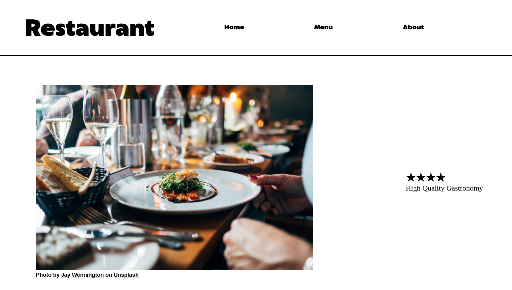

# Restaurant Page

## Overview

This project is a single-page application that dynamically loads different sections of a restaurant website. It includes a homepage, a menu page, and a contact page, all managed through JavaScript modules. The project helps in understanding the basics of DOM manipulation, module bundling, and project organization.

## Live Preview

You can try it by clicking this [link](https://shalakushka.github.io/restaurant-page).
